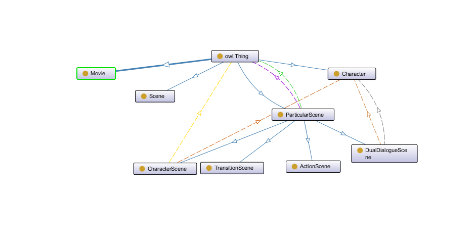

# Knowledge Engineering Project 2021: SemScript

- ###  Elisabetta Fedele  ([@elisabettafedele](https://github.com/elisabettafedele))   elisabetta.fedele@mail.polimi.it
- ###  Filippo Lazzati ([@filippolazzati](https://github.com/filippolazzati))   filippo.lazzati@mail.polimi.it

## 1. Knowledge Engineering

### 1.1 Competency questions
In order to create the ontology, we started from the following competency questions:

1) Which characters speak in german at least once?
2) Which characters say a sentence x?
3) Which are the numbers of the scenes played in a New York taxicab during night?
4) Which are the pages occupied by the scene number x?
5) In which part of the day does the scene number x take place?
6) How many times is the word "Facebook" used?
7) Which is the starting page of the scene x?
8) How many times 2 characters x and y are in the same scene?

9) Which are all the movies inside the dataset?

### 1.2 Ontology structure
The ontology is written in OWL and its structure is the following:
- Movie
- Character
- ParticularScene
  - ActionScene
  - CharacterScene
  - DualDialogueScene
  - TransitionScene
- Scene

Where Movie, Character, ParticularScene and Scene are the three main classes and ActionScene, CharacterScene, DualDialogueScene and TransitionScene are subclasses of ParticularScene. 

A representation of the classes made by OntoGraf:

Movie represents a movie. It has only the title property. It is as a named graph.

Scene represents a main scene of the movie. 
A scene has properties about the location and the time in which
it is played and other information about the pages it occupies on the screenplay.

Character represents a character of the movie, with its name and the sentences he says during the movie.
Furthermore, it has associated a hasModifier property which provides information about the visibility of
the character in a scene (see [Screenplay](https://en.wikipedia.org/wiki/Screenplay)) .

Finally, ParticularScene is just a superclass of ActionScene, CharacterScene, DualDialogueScene and TransitionScene.
The suffix -scene should not be mis-interpreted. In our model, a ParticularScene is the basic unit of a Scene, and
it can be of 4 different types according to what in this unit happens (a dialogue, an action or a transition).

## 2. Data Linking

1) The screenplays in pdf format can be downloaded from the following [website](https://www.scriptslug.com/);
2) In order to obtain a format that can be easy translated to rdf, we used a pdf to json converter for screen play from [SMASH-CUT](https://github.com/SMASH-CUT/screenplay-pdf-to-json);
3) RDF triples can be obtained from Json format through RML rules. There exists a facility language called YARRRML
   (sub-language of YAML) which allows to write RML rules in a less tricky way. To test the YARRRML rules the
   online tool [Matey](https://rml.io/yarrrml/matey/) has been used. The [rules.yaml](rules.yaml) file contains the
   YARRRML rules whereas the [yarrrml parser](https://github.com/RMLio/yarrrml-parser) library can be used
   to convert this file to into [rules.rml](rules.rml); 
   In order to achieve this, open the prompt and write the following command:
   
   `yarrrml-parser -i rules.yaml -o rules.rml`

4) [rmlmapper-4.9.0.jar](rmlmapper-4.9.0.jar) taken from the public [repository](https://github.com/RMLio/rmlmapper-java) executes RML rules to generate Linked Data.
   It has been used to create the RDF triples from the JSON files (screenplays).
   The command is:
   
   `java -jar rmlmapper-4.9.0.jar -m rules.rml -o SemScript/src/main/resources/movies_in_rdf/the_social_network.rdf`
   
   through the above command, you can use the rules.rml file to transform the [the_social_network.json](https://github.com/elisabettafedele/KeProjectSemScript/blob/main/SemScript/src/main/resources/movies_in_rdf/the_social_network.ttl)
   file (contained in /movies) to [the_social_network.rdf](https://github.com/elisabettafedele/KeProjectSemScript/blob/main/movies/the_social_network.json) file.
   It should be remarked that rmlmapper provides in output a file with ANSI encoding, while the Jena API's
   work with the UTF-8 one. Therefore a change should be done. Moreover, the client class works with .ttl files,
   so the extension of the output file ([the_social_network.rdf](https://github.com/elisabettafedele/KeProjectSemScript/blob/main/SemScript/src/main/resources/movies_in_rdf/the_social_network.ttl)) has to be changed (to .ttl).
   
Note:  inside the [embedded_client_server_multiple_movies](SemScript/src/main/java/it/polimi/ke/embedded_client_server_multiple_movies) there is a server which can be launched
       and it creates a dataset (without using reasoners) with named graphs: each movie represents a named graph and can be queries with [these queries](SemScript/src/main/resources/queries_multiple_movies).

## 3. Semantic Web Application

The competency questions in the [competency_questions.txt](https://github.com/elisabettafedele/KeProjectSemScript/blob/main/competency%20questions.txt) file have been converted to the SPARQL queries contained
in the [queries folder](https://github.com/elisabettafedele/KeProjectSemScript/tree/main/SemScript/src/main/resources/queries). They can be executed in different ways:
1) run the EmbeddedServer (namely a [Fuseki server](https://jena.apache.org/documentation/fuseki2/)) class with the proper name of the movie to query, and after run the ClientForEmbeddedServer
   class which will connect to the [EmbeddedServer](https://github.com/elisabettafedele/KeProjectSemScript/blob/main/SemScript/src/main/java/it/polimi/ke/embedded_client_server/EmbeddedServer.java) and run the queries. Both of these classes use the [Jena](https://jena.apache.org/) API's.
   In particular, the [EmbeddedServer](https://github.com/elisabettafedele/KeProjectSemScript/blob/main/SemScript/src/main/java/it/polimi/ke/embedded_client_server/EmbeddedServer.java) class builds a Model for the ontology [SemScript.owl](https://github.com/elisabettafedele/KeProjectSemScript/blob/main/SemScript.owl) and one for the data
   (example: [the_social_network.ttl](https://github.com/elisabettafedele/KeProjectSemScript/blob/main/SemScript/src/main/resources/movies_in_rdf/the_social_network.ttl) and uses the standard OWL reasoner of Jena to infer new data. The client connects
   to it on the 3031 port (custom value, since the fuseki server usually runs on the 3030 port) and submits the queries.
2) another way is to download the fuseki-server on your pc ([download here](https://jena.apache.org/download/index.cgi)) and after run
   it (in windows, use the fuseki-server command from CLI inside the downloaded directory). Now a browser can be used
   to connect to it ([localhost:3030](http://localhost:3030/)) and run queries with UI.
2')an additional method strictly related to the 2) one is to run a Fuseki server but, instead of running the queries
   with UI, running them by the [outSPARQL](https://plugins.jetbrains.com/plugin/16503-outsparql) plugin for intellij
   (add a SPARQL endpoint in the plugin settings specifying the location, namely port 3030, then open a .rq file 
   and run the query).
3) a last method is to run the Fuseki server on your pc (maybe using [this image](https://hub.docker.com/r/stain/jena-fuseki))
   and configure it as specified at 2), and after using the jupyter notebook [QueriesSPARQL.ipynb](https://github.com/elisabettafedele/KeProjectSemScript/blob/main/QueriesSPARQL.ipynb) to run the queries.

Some last notes:
- you can configure a reasoner on the Fuseki server by using the [fuseki_server_config_file.ttl](https://github.com/elisabettafedele/KeProjectSemScript/blob/main/fuseki_server_config_file.ttl) provided (only
  few  words have to be changed).
  

## Tools

* [Protégé](https://protege.stanford.edu) - Ontology Creation
* [Matey](https://rml.io/yarrrml/matey/) - RDF Mappings Generator
* [Maven](https://maven.apache.org/) - Dependency Management
* [IntelliJ](https://www.jetbrains.com/idea/) - IDE
* [outSPARQL](https://plugins.jetbrains.com/plugin/16503-outsparql) - Plugin for running queries
* [Jupyter notebook](https://jupyter.org/) - IDE
* [YARRRML parser](https://github.com/RMLio/yarrrml-parser) - YARRRML parser
* [RML mapper](https://github.com/RMLio/rmlmapper-java) - Linked Data producer
* [Docker](https://www.docker.com/) - Appication deployer